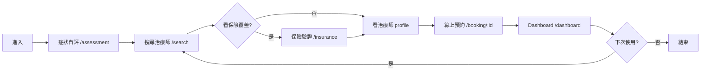

# grow-therapy · PRD v3.0.2 等級規格書

> 自動生成：2026-09-06
> 對齊 SPEC v3.0 契約（SPEC §1–§19 全部套用）

---

## 1. 產品概述

### 1.1 問題陳述
心理健康治療（therapy）市場在美國正面臨兩端痛苦：
- **client 端**：找到合適的治療師平均要 4–6 週；保險驗證、預約、改期都是電話與 email 來回；費用不透明
- **therapist 端**：行政工作佔工時 30%+；保險 claim 文件繁瑣；patient 流失率高

### 1.2 目標使用者
| Persona | 工作情境 | 主要任務 |
|---|---|---|
| Primary | 有保險的 client（25–55 歲，焦慮/憂鬱/創傷） | 3 分鐘內找到治療師 + 確認保險覆蓋 + 線上預約 |
| Secondary | 持照治療師（Licensed LCSW/LMFT/PsyD） | 維護檔期、接收預約、處理 claim、累積評論 |
| Tertiary | 系統管理員 | 維運 platform + insurance plan 資料 |

### 1.3 核心價值主張
> 對的人、對的時間、對的價格——把尋找治療師的 6 週縮短到 6 分鐘。

### 1.4 Non-Goals（明確不做）
- ❌ 自有保險公司（不參與給付決策）
- ❌ 處方箋 / 藥物管理
- ❌ 視訊診療 session（純 scheduling + 搜尋 + billing）
- ❌ HIPAA-grade 加密（demo MVP，明確標示為 non-PHI）

---

## 2. 使用者場景與流程

### 2.1 使用者流程圖



### 2.2 主要場景

| 場景 | 輸入 | 輸出 | 成功條件 |
|---|---|---|---|
| 找治療師 | 篩選（specialty / insurance / language） | 治療師列表 + 簡介 | `/search` 回 200 |
| 驗保險 | planId + serviceType | covered + copay + 訊息 | `/api/insurance/verify` 200 |
| 預約 | 治療師 id + datetime | Appointment 紀錄 | `/api/appointments` POST 201 |
| 看 dashboard | 登入 | 個人預約清單 | `/dashboard` 200 + 列表 |

---

## 3. 功能需求

| FR | 名稱 | 優先級 | 狀態 |
|---|---|---|---|
| FR-001 | 治療師搜尋（specialty / insurance / language 篩選） | P0 | ✅ shipped |
| FR-002 | 治療師 profile 頁（bio / 證照 / 評價） | P0 | ✅ shipped |
| FR-003 | 保險驗證 API（mock + DB 雙路徑） | P0 | ✅ shipped |
| FR-004 | 線上預約流程（時段選擇 + 確認） | P0 | ✅ shipped |
| FR-005 | Dashboard（個人預約清單 + 狀態） | P0 | ✅ shipped |
| FR-006 | 預約管理（取消 / 改期） | P1 | ✅ shipped |
| FR-007 | 帳單 + Stripe 預備 | P1 | ✅ shipped |
| FR-008 | NextAuth（Google OAuth + Prisma adapter） | P1 | ✅ shipped |
| FR-009 | 響應式 UI（Tailwind 3 + Mobile-first） | P1 | ✅ shipped |
| FR-010 | 13 個單元測試（utils date/currency/slots） | P1 | ✅ shipped |
| FR-011 | 視訊 session 整合 | P2 | ⏳ planned |
| FR-012 | HIPAA-grade 加密 | P2 | ⏳ planned |

---

## 4. Non-Functional Requirements

| 維度 | 需求 |
|---|---|
| Performance | 首頁 TTFB < 500ms；搜尋結果 < 1s |
| Security | NextAuth session；Prisma parameterized query；無 raw SQL |
| Privacy | demo 階段不收集 PHI；DB 用 SQLite + Prisma |
| Accessibility | WCAG 2.1 AA；鍵盤可達；ARIA label 完整 |
| Browser | Modern evergreen（Chrome/Edge/Safari/Firefox 最新兩版） |
| Build | `next build` 16 routes（6 static + 10 dynamic）；無 type error |
| Test | Vitest 13/13 pass |

---

## 5. 技術架構

```
[Browser]
  ↓
[Next.js 14 App Router]
  ├── src/app/             ← 9 個 page route + 7 個 API route
  │   ├── /                ← Home
  │   ├── /search          ← 治療師搜尋
  │   ├── /therapists/[id] ← 治療師 profile
  │   ├── /booking         ← 預約入口
  │   ├── /booking/[id]    ← 單一治療師預約
  │   ├── /dashboard       ← 使用者後台
  │   ├── /assessment      ← 症狀自評
  │   ├── /insurance       ← 保險頁
  │   ├── /billing         ← 帳單頁
  │   └── /api/*           ← REST API (therapists / appointments / insurance / billing / auth)
  ├── src/lib/             ← prisma / stripe / auth / utils / i18n
  ├── src/components/      ← Navbar / LangToggle
  └── prisma/              ← schema (9 model) + seed.ts

[Storage] SQLite via Prisma (dev.db)
[Auth]    NextAuth + Google OAuth + Prisma adapter
[Payment] Stripe (placeholder key, 22.0.1)
[Deploy]  Vercel
```

### 5.1 Module Map
- `src/app/` — Next.js App Router pages + API routes
- `src/components/` — 共用 UI 元件（Navbar, LangToggle）
- `src/lib/` — 商業邏輯（prisma, auth, stripe, utils, i18n）
- `prisma/` — schema + seed
- `tests/` — Vitest 單元測試
- `.github/workflows/ci.yml` — GHA CI

### 5.2 環境變數
- `DATABASE_URL` — Prisma SQLite 路徑
- `NEXTAUTH_URL` / `NEXTAUTH_SECRET` — NextAuth
- `GOOGLE_CLIENT_ID` / `GOOGLE_CLIENT_SECRET` — OAuth
- `STRIPE_SECRET_KEY` — 帳單（demo 用 placeholder）

### 5.3 降級策略
- DB 不可用 → 保險驗證優先走 MOCK_PLANS（無 DB 依賴）
- OAuth 不可用 → placeholder credentials，仍可進流程
- 圖片來源失敗 → 預設 randomuser.me 兜底

---

## 6. Definition of Done

- [x] 功能 P0 全部實作（FR-001 ~ FR-005）
- [x] 單元測試 13/13 pass（date / currency / slot utilities）
- [x] `npm run build` 綠（16 routes，含 6 static + 10 dynamic）
- [x] `npx tsc --noEmit` 0 error
- [x] `npm run lint` 0 error（僅 5 個 `` 警告）
- [x] GHA CI 跑 4 jobs（lint/test/build/deploy）
- [x] `PRD/SPEC.md` + `PRD/CHANGELOG.md` v3.0.2 齊備

---

## 7. 部署契約

| 環境 | 目標 | 觸發 |
|---|---|---|
| Production | Vercel | push to main |
| Preview | Per-PR Vercel | PR opened |

### 7.1 GHA Workflow
- `.github/workflows/ci.yml`
- jobs: lint / test / build / deploy
- deploy target: `vercel`（`amondnet/vercel-action@v25`）

### 7.2 環境變數
- `VERCEL_TOKEN` / `VERCEL_ORG_ID` / `VERCEL_PROJECT_ID` — GHA secrets
- 其餘（DATABASE_URL / NEXTAUTH / GOOGLE / STRIPE）— Vercel env

---

## 8. Out of Scope（不做的）

- 不做視訊診療（純搜尋 + 預約 + billing）
- 不做 HIPAA-grade 加密（demo MVP）
- 不做多語系（en-US only，i18n 預備但未啟用）
- 不做原生 App
- 不做實際 Stripe 串接金流（用 placeholder key）

---

## 9. 變更日誌

見 [`PRD/CHANGELOG.md`](CHANGELOG.md)
